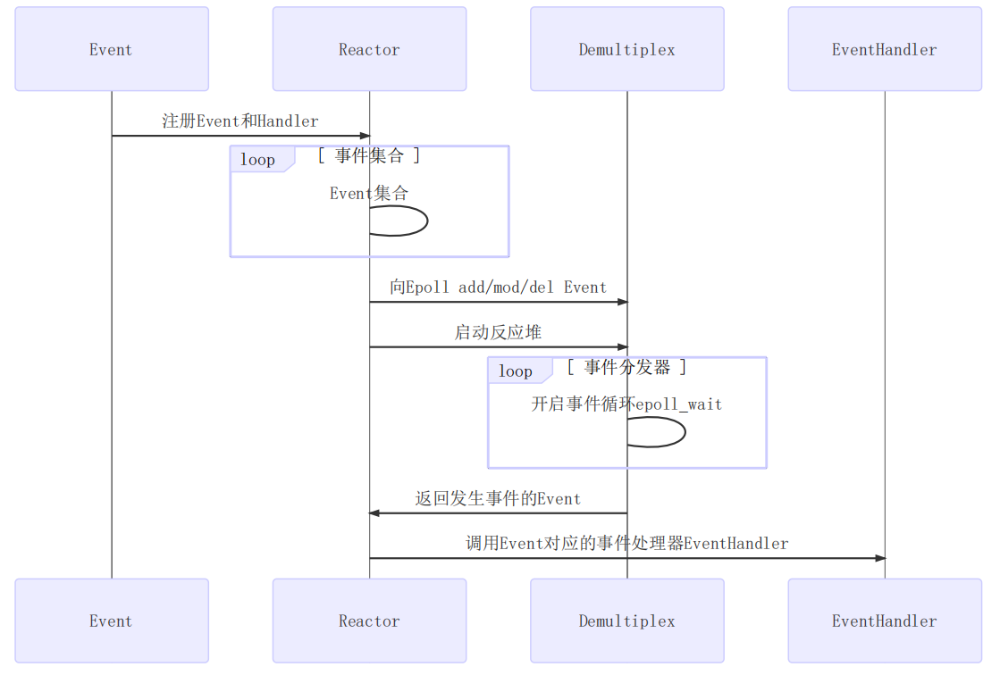
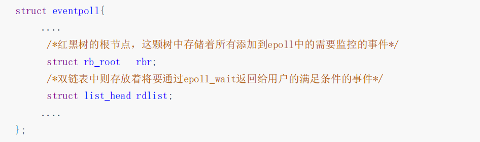

```
这是基于一个mudou网络库的内容的Perject
mudtest: 使用一些简单的方法
selfmudou: 自己实现的一个简单网络库
Testinstallation: 测试自己安装库是否有用
```
# 前期准备

**首先安装boost库（基于ubuntu）** 

> sudo apt-get update \
> sudo apt-get install libboost-all-dev \
> 安转好之后，默认安装目录在 /usr/include/boost , 如果没有这样的软件包，使用手动下载 Boost \
> wget -O boost_1_55_0.tar.gz https://sourceforge.net/projects/boost/files/boost/1.55.0/boost_1_55_0.tar.gz/download \
> tar xzvf boost_1_55_0.tar.gz \
> cd boost_1_55_0/ \
> 获取所需的库，主要的是boost::regex支持的icu：\
> sudo apt-get update \
> sudo apt-get install build-essential g++ python-dev autotools-dev libicu-dev build-essential libbz2-dev libboost-all-dev \
> Boost的引导程序设置：./bootstrap.sh --prefix=/usr/ \
> sudo ./b2 install
---
**安装Json库（基于ubuntu）** 

1. 安装jsoncpp：
   1. > sudo apt update
   2. > sudo apt install libJsoncpp-dev
2. 安装json-c：
   1. > sudo apt update
   2. > sudo apt install libjson-c-dev 

这样编译出来Json库（其中Jsoncpp是动态库），需要用静态库就需要在下载下来重新编译

---

**安装muduo库**

muduo库的介绍就是：一个基于reactor反应堆模型的多线程C++网络库。(<font color="red">注意：需要提前安装cmake和boost环境</font>)

> git clone https://github.com/chenshuo/muduo 
> cd muduo \
> ./build.sh install \
> 再把其中头文件和静态库文件移动到相应目录下

<font color = "green"> muduo网络库给用户提供两个主要的类：\
TcpServer : 用于编写服务端程序。\
TcpClient : 用于编写客户端程序。
</font>

epoll + 线程池 \
好处：能够把网络 I/O的代码和业务代码区分开（用户的链接和断开，用户的可读写事件）

<em>基于muduo网络库开发服务器程序：
1. 组合TcpServer对象。
2. 创建EvenetLoop事件循环对象的指针。
3. 明确TcpServer构造函数需要什么参数，输出ChatServer的构造函数。
4. 在当前服务器类的构造函数当中，注册处理连接的回调函数和处理读写事件的回调函数。
5. 设置合适的服务端线程数量，muduo库会自己分配I/O线程和worker线程。</em>

**重要组件：Event事件，Reactor反应堆，Demultiplex事件分发器，Evanthandler事件处理器**


## epoll，select与poll的缺点
**select的缺点：**

1. 单个进程能够监视的文件描述符的数量存在最大限制，通常是1024，当然可以更改数量，但由于 select 采用轮询的方式扫描文件描述符，文件描述符数量越多，性能越差；（在linux内核头文件中，有这样的定义：#define _FD_SETSIZE 1024）。
2. 内核/用户空间内存拷贝问题，select需要复制大量的句柄数据结构，产生巨大的开销。
3. select返回的是含有整个句柄的数组，应用程序需要遍历整个数组才能发现哪些句柄发生了事件。
4. select的触发方式是水平触发，应用程序如果没有完成对一个已经就绪的文件描述符进行IO操作，那么之后每次select调用还是会将这些文件描述符通知进程

相比select模型，poll使用链表保存文件描述符，因此没有了监视文件数量的限制，但其他三个缺点依然存在。

以select模型为例，假设我们的服务器需要支持100万的并发连接，则在__FD_SETSIZE 为1024的情况下，则我们至少需要开辟1k个进程才能实现100万的并发连接。除了进程间上下文切换的时间消耗外，从内核/用户空间大量的句柄结构内存拷贝、数组轮询等，是系统难以承受的。因此，基于select模型的服务器程序，要达到100万级别的并发访问，是一个很难完成的任务。相比select模型，poll使用链表保存文件描述符，因此没有了监视文件数量的限制，但其他三个缺点依然存在。

以select模型为例，假设我们的服务器需要支持100万的并发连接，则在__FD_SETSIZE 为1024的情况下，则我们至少需要开辟1k个进程才能实现100万的并发连接。除了进程间上下文切换的时间消耗外，从内核/用户空间大量的句柄结构内存拷贝、数组轮询等，是系统难以承受的。因此，基于select模型的服务器程序，要达到100万级别的并发访问，是一个很难完成的任务。

**epoll原理以及优势**

epoll的实现机制与select/poll机制完全不同，它们的缺点在epoll上不复存在。

设想一下如下场景：有100万个客户端同时与一个服务器进程保持着TCP连接。而每一时刻，通常只有几百上千个TCP连接是活跃的(事实上大部分场景都是这种情况)。如何实现这样的高并发？

在select/poll时代，服务器进程每次都把这100万个连接告诉操作系统（从用户态复制句柄数据结构到内核态），让操作系统内核去查询这些套接字上是否有事件发生，轮询完成后，再将句柄数据复制到用户态，让服务器应用程序轮询处理已发生的网络事件，这一过程资源消耗较大，因此，select/poll一般只能处理几千的并发连接。

epoll的设计和实现与select完全不同。epoll通过在Linux内核中申请一个简易的文件系统（文件系统一般用什么数据结构实现？B+树，磁盘IO消耗低，效率很高）。把原先的select/poll调用分成以下3个部分：

1）调用epoll_create()建立一个epoll对象（在epoll文件系统中为这个句柄对象分配资源）
2）调用epoll_ctl向epoll对象中添加这100万个连接的套接字
3）调用epoll_wait收集发生的事件的fd资源

如此一来，要实现上面说是的场景，只需要在进程启动时建立一个epoll对象，然后在需要的时候向这个epoll对象中添加或者删除事件。同时，epoll_wait的效率也非常高，因为调用epoll_wait时，并没有向操作系统复制这100万个连接的句柄数据，内核也不需要去遍历全部的连接。



